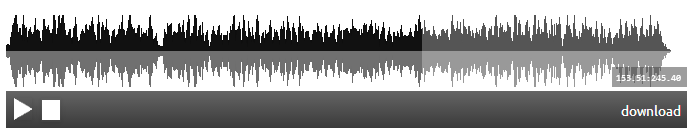

mp3bonez-player (Inspired by and conspired with) http://bonez.soundbyter.com/)
===============

mp3bonez-player is a fully responsive Wordpress mp3 player based on WavesurferJS

# Usage

### Wordpress Shortcode

TODO: Insert WP URL

#### URL Source Example 

#### **NOTE:  Must allow cross domain traffic if referencing another domain

[mp3bonez-player src="[url to source]"]

#### Server File Source Example

You can specify a specific file relative to your wp-content folder

[mp3bonez-player src="path/to/mp3/file/songName.mp3" src_relative_to_wp_content="true"]

#### Responsive Layout

The "width" attribute is ignored when using responsive layout. Player sizes to full width of container

[mp3bonez-player src="[url to source]" responsive="true"]

#### Options List

src (string): audio file name or URL
src_relative_to_wp_content (boolean string 'true' | 'false'):  flag to designate file system usage. 'true' if using file system - 'false' by default
height (int string): height of player (not a CSS attribute)
width (int string): width of player (not a CSS attribute) **Ignored if responsive="true"
wave_color: CSS color for wave
progress_color: CSS color for progress of wave
responsive (boolean string): flag to turn responsive layout on / off.